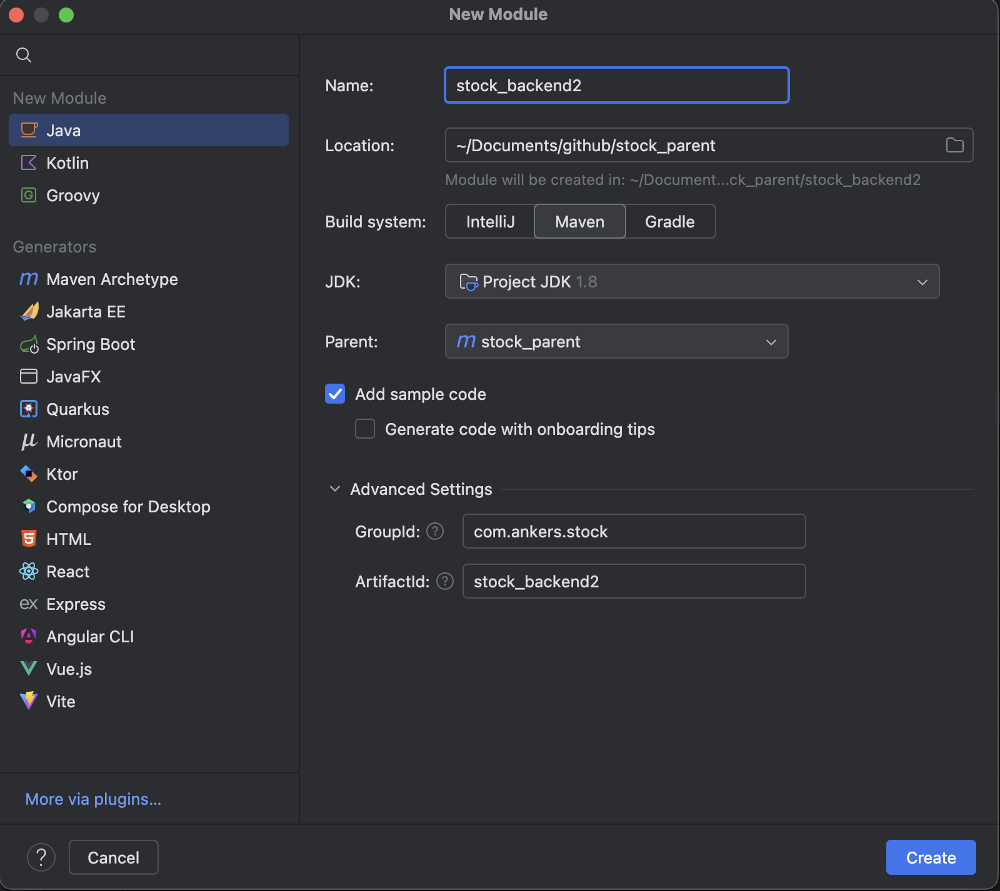
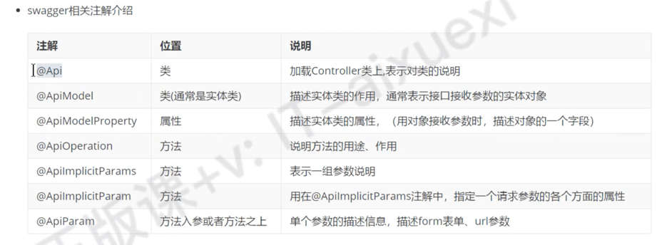
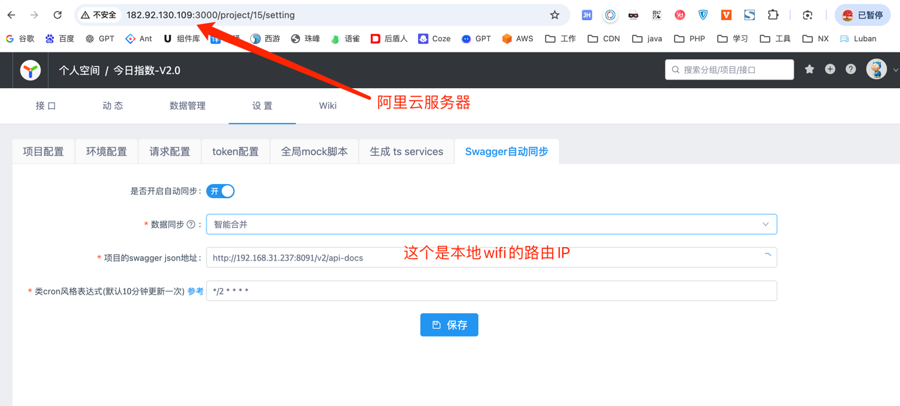
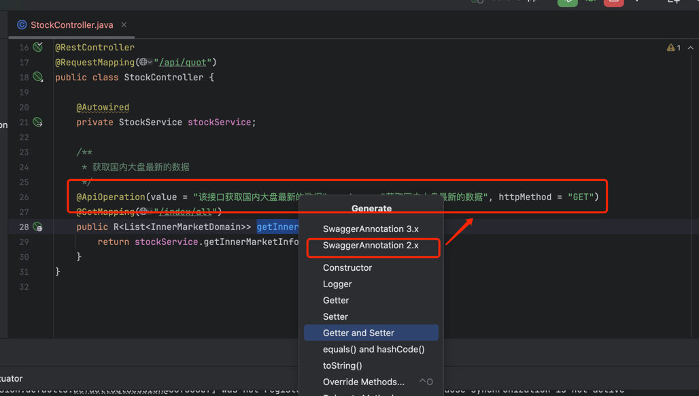
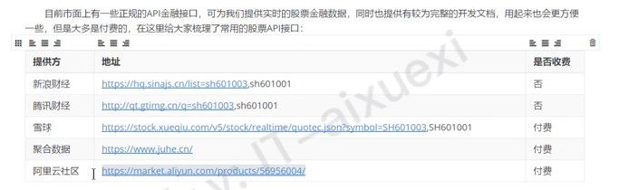
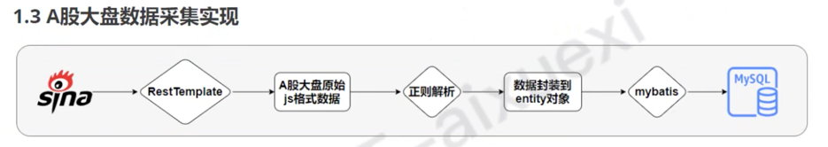

## stock_parent
该项目是java练习项目

#### 配置JDK参考如下



#### UI API
```text
http://localhost:8091/swagger-ui.html

http://localhost:8091/doc.html
```




#### centos配置 yapi
```text
https://www.jianshu.com/p/a97d2efb23c5

初始化管理员账号成功,账号名："admin@anoyi.com"，密码："ymfe.org"

配置自己的服务器地址
http://182.92.130.109:3000/
```

#### swagger 自动同步 yapi
```text
swagger 插件
https://blog.csdn.net/qq_31536117/article/details/134638624

项目启动之后，打开链接 
http://192.168.31.237:8091/v2/api-docs

把链接里面的 json 上传到阿里云服务器下面
/var/node/swagger-json/swagger.json
```



#### 股票API
```text
https://hq.sinajs.cn/list=sh601003,sh601001

https://qt.gtimg.cn/q=sh601003,sh601001
```

